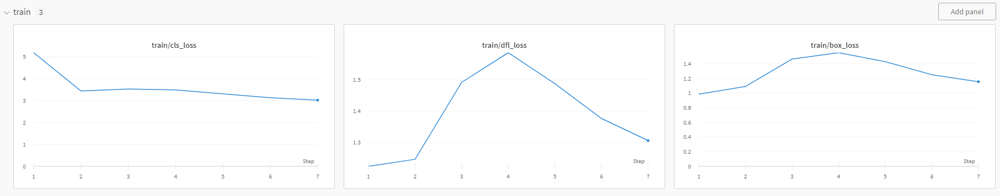
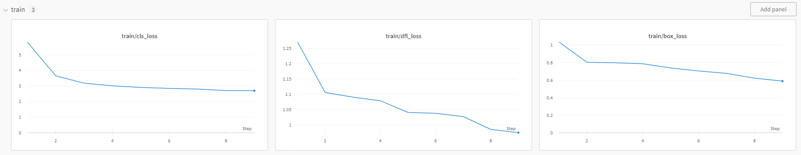

# ITMO_CV_Course

Детекция лесных пожаров в начальной стадии при помощи БПЛА

На этой ветке велись эксперименты с моделями.

В качестве модели была выбрана yolov8n, так как необходимо размещение локально на беспилотнике.

Логирование и наблюдение велось в Weights and Biases, оптимимзатор Adam, lr=e-4, размер изображения 640

Сравнение оптимизаторов:

SGD с большим lr работает не хорошо

SGD с оптимальным lr работает хорошо на начальных эпохах, но становится хуже потом

Лучшим оптимизатором оказался Adam:

Ml метрикой были выбраны mAP и mAP50-95

Наилучшим достигнутым результатом являлся mAP ~ 0.31 на 35 эпохах обучения.
Далее начинается overfit.

