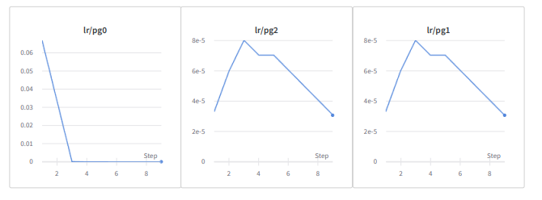
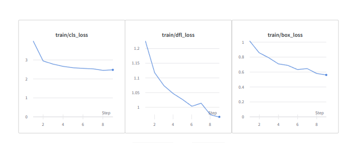

# ITMO_CV_Course

Детекция лесных пожаров в начальной стадии при помощи БПЛА

На этой ветке велись эксперименты с моделями.

Логирование и наблюдение велось в Weights and Biases, оптимальным количеством эпох оказалось ~35, lr=e-4, размер изображения 640

В качестве модели была выбрана yolov8n, так как необходимо размещение локально на беспилотнике.

