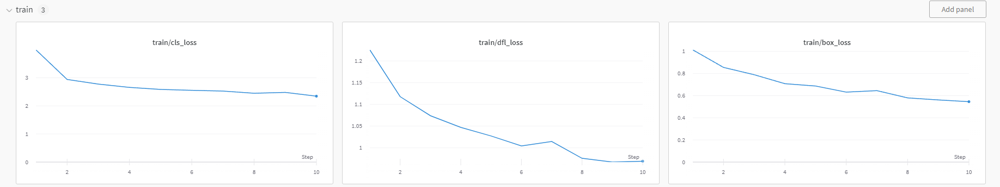

# ITMO_CV_Course

Детекция лесных пожаров в начальной стадии при помощи БПЛА

На этой ветке велись эксперименты с моделями.

В качестве модели была выбрана yolov8n, так как необходимо размещение локально на беспилотнике.

Логирование и наблюдение велось в Weights and Biases, оптимимзатор Adam, lr=e-4, размер изображения 640

В экспериментах произведено сравнение оптимизаторов SGD и Adam:

SGD с большим lr работает посредственно:

SGD с оптимальным lr работает хорошо на начальных эпохах, но становится хуже потом:

Лучшим оптимизатором оказался Adam:

**Вывод**: на тестах с оптимальным learning rate Adam показывает более устойчивые результаты в минимизации loss-функций 
по сравнению с SGD. Таким образом оптимизатор Adam был выбран целевым для обучения модели.

**Выбор метрик**:
ML-метриками для оценки качества модели были выбраны mAP и mAP50-95
mAP (mean Average Precision) и mAP50-95 (mean Average Precision with thresholds 50%-95%) - это популярные метрики для 
оценки качества работы алгоритмов компьютерного зрения, особенно в задачах обнаружения объектов. Метрики mAP учитывают 
не только точность предсказаний, но и их полноту, что важно для обнаружения объектов в компьютерном зрении.

**Вывод**: наилучшим достигнутым результатом являлся mAP ~ 0.31 на 35 эпохах обучения.
Далее начиналось переобучение модели.

