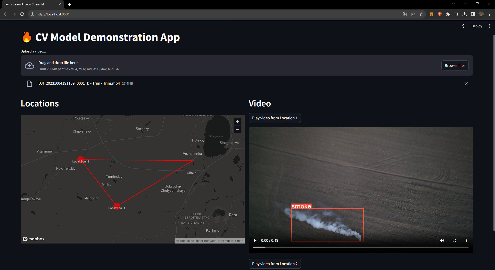

# ITMO_CV_Course

Детекция лесных пожаров в начальной стадии при помощи БПЛА

## Датасеты

- [Классификация](https://www.kaggle.com/datasets/chandranaveenkumar/forest-fires-classification)

- [Forest Fire | Kaggle - Аэрофотки лесного пожара](https://www.kaggle.com/datasets/kutaykutlu/forest-fire)

- [The wildfire dataset | Kaggle - Большой датасет (не строго аэро-) фоточек](https://www.kaggle.com/datasets/elmadafri/the-wildfire-dataset)

- [UAV **Thermal** Imaginary - Fire Dataset | Kaggle](https://www.kaggle.com/datasets/adiyeceran/uav-thermal-imaginary-fire-dataset)

- [GitHub - DeepQuestAI/Fire-Smoke-Dataset: dataset for training fire and frame detection AI](https://github.com/DeepQuestAI/Fire-Smoke-Dataset)

- [Data article Aerial imagery pile burn detection using DL: The FLAME dataset](https://github.com/DeepQuestAI/Fire-Smoke-Dataset)
  - [The FLAME dataset | IEEE DataPort](https://ieee-dataport.org/open-access/flame-dataset-aerial-imagery-pile-burn-detection-using-drones-uavs)

Датасеты на Roboflow:

- [Fire detection in the Jungle Image Dataset (128)](https://universe.roboflow.com/suman-gole/firedetectioninthejungle/dataset/1)
- [forest-fire Image Dataset (181)](https://universe.roboflow.com/forestfire-ebdlc/forest-fire-p9oe7/dataset/1)
- [Fire Images Image Dataset (2003)](https://universe.roboflow.com/firedetection-7jmbo/fire-images-yajsk/dataset/2)
- [Flame 3 Diffusion (2083)](https://universe.roboflow.com/maxgray/flame-3-diffusion) - **(added)**
- [ForestFireDetection (302)](https://universe.roboflow.com/forest-fire-qxlzs/forest_fire_detection-lntg8)
- [Forest_smoke_collect Computer Vision Project (5054)](https://universe.roboflow.com/journalfinal/forest_smoke_collect)

Трекинг планируется фильтром калмана/deepsort. Данные можно фидить большим моделям типа GroundingDino/Detic/Что найдем и получать почти размеченные датасеты

---

### Модели для бенча 
1. [Smoke & Fire F1 score=.99.9% | Kaggle](https://www.kaggle.com/code/gpiosenka/smoke-fire-f1-score-99-9)
2. [GitHub - OlafenwaMoses/FireNET](https://github.com/OlafenwaMoses/FireNET/tree/master) | [[arXiv 1905.11922] FireNet: IoT Model](https://arxiv.org/abs/1905.11922)

### Стоимость выхода в production
Пока только первичные прикидки.

Если jetson orin большой - то 500к только на плату, если нано 70к.
если вывезем на Orange Pi5 Pro, что сделала neural magic, то 20к и модули на симку и тп, плюс независимость от nvidia, сейчас проблемы с поставками jetson сами знаете почему

### Расчет стоимости датасета
Для обучения модели необходимо ~60000 готовых картинок. Автоматическая разметка 15000 изображений, на видеокарте Т4, занимает около 4 часов, т.е. требуется около 16 на весь датасет. Далее, промежуточный результат необходимо провалидировать.
Опытным путем выясняем, что в час реально проверить ~60 картинок, т.е. валидация всего датасета займет около 1000 часов. 

Отсюда вычисляем приблизительную стоимость: 
((16 * 2) * 10) = 320 руб. - стоимость 32х выч. единиц в Google Collab;
(1000 * (13000/160) = 12700 руб. - оплата труда сотрудника.

Итого: ~13020 руб.

### Платформа
Для тестов (читай прикинуть стоимость) - можно искать аренду
Пример “большой” платформы - [Геоскан 701](https://www.geoscan.ru/ru/products/geoscan701)
Более простая база - [Геоскан 201](https://www.geoscan.ru/ru/products/geoscan201/geo) или [лайт](https://www.geoscan.ru/ru/products/lite). Нашел даже [пост](https://www.geoscan.ru/ru/blog/geoscan-201-na-sluzhbe-ministerstva-lesnogo-khozyaystva-novgorodskoy-oblasti), как его применяют с очень похожей целью. 
Оба могут нести на себе тепловизор / обычную камеру.

**Идеальная платформа** - VTOL (самолетный тип с возможностью вертикального взлета-посадки). 
Самолетный тип сам по себе не позволяет сделать систему простой в обслуживании и компактной, а коптер будет иметь меньшую дальность/длительность полета. 

Дальнейшая реализация подразумевает полную автоматизацию операций с БПЛА, как [DJI Dock](https://enterprise.dji.com/ru/dock) или [Zipline](https://www.flyzipline.com/). 
Текущие решения требуют серьезного обслуживания на земле и не подходят полноценно под задачи постоянного мониторинга.

Имеется вопрос с **расположением компьюта**:
- на БПЛА - самый оперативный вариант, моментальный пинг о детекте по радиоканалу в случае чего.
- даунлинк в реалтайме - нужно поресерчить технические ограничения
- выгрузка и обработка между вылетами - медленно, может требовать повторного вылета для подтверждения, что еще сильнее замедляет работу.

**Идеальное решение** будет работать на БПЛА, но это при условии достижения необходимой производительности и точности на ограниченных ресурсах

### Архитектура:

### Демонстрация

Демо веб-морды [реализовано](streamlit_map.py) с использованием фреймворка Streamlit.

### Стэк:
- torch/torchvision
- roboflow/CVAT
- OpenCV/CV2/skimage/что удобно
- ultralytics
- autodistill

### Литература:
1. [Wiki](https://en.wikipedia.org/wiki/Drones_in_wildfire_management)
2. [Forest Fire Identification in UAV Imagery Using X-MobileNet](https://www.mdpi.com/2079-9292/12/3/733)
3. [Early Forest Fire Detection Using Drones and Artificial Intelligence](https://ieeexplore.ieee.org/document/8756696)
4. **[Forest fire flame and smoke detection from UAV-captured images using fire-specific color features and multicolor space local binary pattern](https://cdnsciencepub.com/doi/full/10.1139/juvs-2020-0009)**
5. [Портативное решение с YOLOv3, 6.5 FPS / 83% детект](https://doi.org/10.1109/ICIAI.2019.8850815)
6. [MsFireD-Net: A lightweight and efficient convolutional neural network for flame and smoke segmentation](https://www.sciencedirect.com/science/article/pii/S2949855423000345?via%3Dihub) - Свежая статья, август 2023
7. [Comets](http://www.comets-uavs.org/applications/fire.shtml) - проект по созданию системы мониторинга от Еврокомиссии (2003 год)
8. **[Forest Fire Monitoring System Based on UAV Team, Remote Sensing, and Image Processing](https://www.researchgate.net/publication/328087679_Forest_Fire_Monitoring_System_Based_on_UAV_Team_Remote_Sensing_and_Image_Processing)**  - разработка очень похожей системы

---

To be continued...
